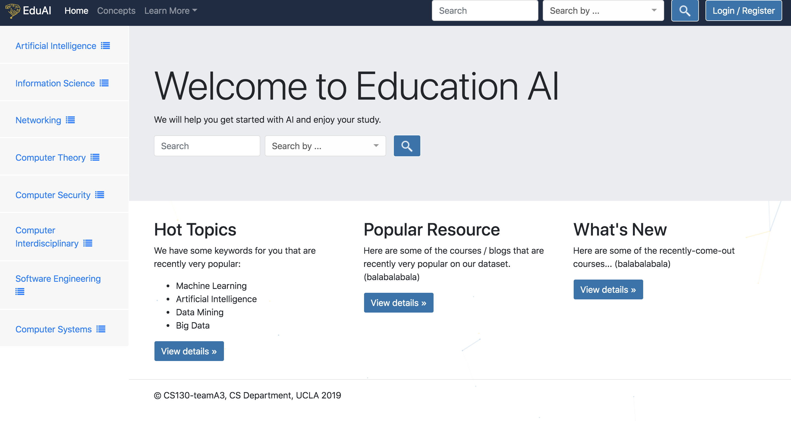

# EducationAI

> Short blurb about what your product does.

[![NPM Version][npm-image]][npm-url]
[![Build Status][travis-image]][travis-url]
[![Downloads Stats][npm-downloads]][npm-url]

One to two paragraph statement about your product and what it does.



## Installation

OS X & Linux:

```sh
python application.py
```


## Usage example
Go to http://0.0.0.0:8888 by default. You can enter the browse mode. Search the relevant concept such as machine learning on the above search bar, you can find relevant courses to the concept. 


## Release History

* Part C
    * Basic functional logics done 
* Part B 
    * Basic Templates Done 
* Part A
    * Work in Progress


## Contributing

1. Fork it (<https://github.com/yourname/yourproject/fork>)
2. Create your feature branch (`git checkout -b feature/fooBar`)
3. Commit your changes (`git commit -am 'Add some fooBar'`)
4. Push to the branch (`git push origin feature/fooBar`)
5. Create a new Pull Request

<!-- Markdown link & img dfn's -->
[npm-image]: https://img.shields.io/npm/v/datadog-metrics.svg?style=flat-square
[npm-url]: https://npmjs.org/package/datadog-metrics
[npm-downloads]: https://img.shields.io/npm/dm/datadog-metrics.svg?style=flat-square
[travis-image]: https://img.shields.io/travis/dbader/node-datadog-metrics/master.svg?style=flat-square
[travis-url]: https://travis-ci.org/dbader/node-datadog-metrics
[wiki]: https://github.com/yourname/yourproject/wiki

## Note
* To meet the course requirement for Part C, we re-committed our repo at Feb. 18. Please just ingore all the previous records before that day. (@Professor, @TA)


## Code structure.

* code
	* This file is for the functional codes, including data crawl and database construction.
	* crawl.py
		* course data crawl.
	* index_module.py
		* build the inverted index database for search. 
